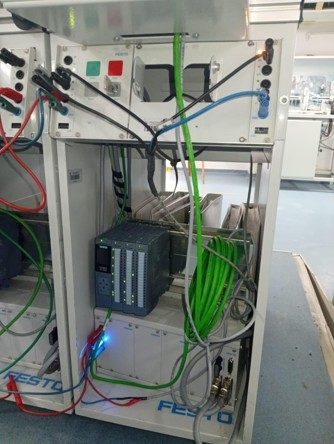
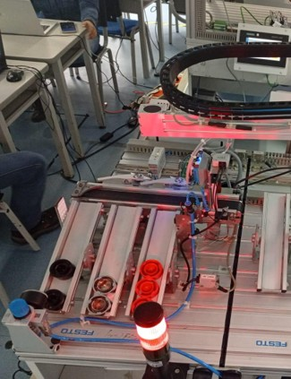
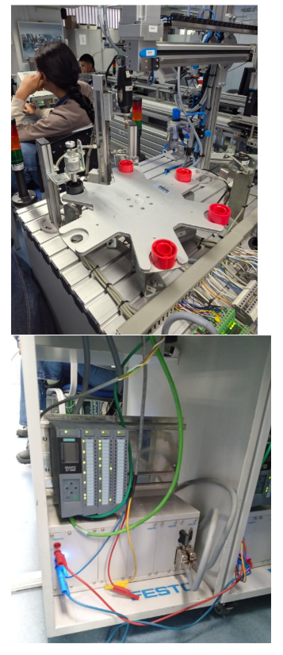

# Portafolio de Automatización Industrial
**Juan Pablo Góngora Charry** · Tecnólogo en Automatización Industrial (SENA) · B.Sc. Robotics Engineering (CEIPA)

---

## Caso 1 — Diagnóstico de capa física y mapeo de I/O
**Plataforma:** Siemens S7-1500 · TIA Portal V19 · FESTO MPS Sorting Station

**Contexto:**
Se programó la lógica de control para una estación de clasificación de piezas por material y color, utilizando sensores inductivos y ópticos.

**Problema:**
Durante el comisionamiento, las señales físicas de los sensores no correspondían con las variables en TIA Portal. La secuencia no ejecutaba correctamente a pesar de que la lógica era válida.

**Diagnóstico:**
Se descartó error de programación y se auditó la capa física. Se identificó que el cableado de la interfaz SysLink estaba invirtiendo los bytes de entrada/salida entre el bloque de terminales y la tarjeta del PLC.

**Solución:**
Se forzaron las entradas físicas una por una desde campo y se monitoreó la Watch Table en TIA Portal para mapear empíricamente cada señal. Se reasignaron los tags (%I / %Q) para reflejar el ruteo real del hardware.

---

## Caso 2 — Control secuencial con instrumentación incompleta
**Plataforma:** Siemens S7-1500 · TIA Portal V19 · FESTO MPS Processing Station

**Contexto:**
Se programó la secuencia de control para una estación de procesamiento con mesa rotatoria, perforadora y múltiples empujadores. La estación había migrado recientemente de S7-300 a S7-1500 con instrumentación parcialmente degradada por desuso prolongado.

**Problema:**
El módulo de perforación carecía de sensores de final de carrera en el eje Z, imposibilitando confirmar las posiciones superior e inferior de la broca.

**Solución:**
Se implementó una secuencia en lazo abierto mediante temporizadores IEC (TON/TOF), condicionada al único sensor disponible: el de sujeción lateral del empujador. Esto garantizaba que la broca no iniciara su descenso sin confirmación física de que la pieza estaba correctamente sujeta.

---

## Caso 3 — Migración de arquitectura y acondicionamiento de señal analógica
**Plataforma:** Siemens S7-300 → S7-1500 · TIA Portal V19 · FESTO MPS PA Station

**Contexto:**
Estación de procesos con dos tanques, sensor de nivel ultrasónico, PT100 con módulo transductor externo (0–10V) y motobomba.

**Problema:**
La lectura de señales analógicas no funcionaba sobre el S7-300 existente. Adicionalmente, el módulo transductor de la PT100 requería configuración de canal específica que no estaba documentada.

**Solución:**
Se migró el control al S7-1500. Se identificó empíricamente la configuración correcta de los canales analógicos (voltaje vs. corriente) contrastando el diagrama físico del módulo con la parametrización en TIA Portal. La señal del sensor de nivel se escaló mediante bloques NORM_X y SCALE_X para obtener valores en unidades de ingeniería, ajustando el límite superior al valor real medido del transductor en lugar del valor teórico estándar.

---

## Electrotecnia industrial
Prácticas realizadas sobre hardware real con motores trifásicos, contactores y protecciones térmicas:
- Arranque directo
- Inversor de giro
- Arranque temporizado
- Arranque delta-estrella

---

## Sistemas embebidos
**Plataforma:** ESP32 · MicroPython

Control diferencial de motores DC mediante PWM para robot móvil con control WiFi. Lógica de mezcla diferencial y clamping de velocidad.
